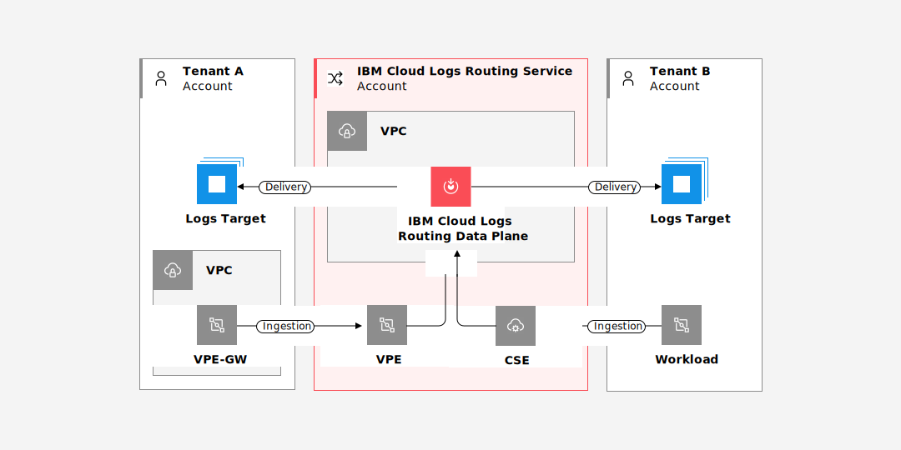

---

copyright:
  years: 2022, 2023
lastupdated: "2023-11-08"

keywords: 

subcollection: logs-router

---

{{site.data.keyword.attribute-definition-list}}

# Learning about {{site.data.keyword.logs_routing_full_notm}} architecture and workload isolation
{: #architecture-and-isolation}

Learn about the architecture and isolation model for {{site.data.keyword.logs_routing_full}}. This information is provided so that you can understand which parts of the service are shared by multiple tenants and which are dedicated to a single tenant. Based on that information you can make an informed decision on how you want to use this {{site.data.keyword.cloud_notm}} service.
{: shortdesc}

## {{site.data.keyword.logs_routing_full_notm}} Architecture
{: #architecture}

The {{site.data.keyword.logs_routing_full}} service is a multi-tenant, platform service that is available in {{site.data.keyword.cloud_notm}}.

You can use {{site.data.keyword.logs_routing_full}} to collect and route logs from both customer and {{site.data.keyword.cloud_notm}} service workloads to one or more configured target destinations. The routing is based on a customer-defined delivery configuration.

The service is deployed as:

* A dedicated log collection agent, which runs on customer-owned infrastructure.
* A shared (multi-tenant) management plane, which runs on IBM-owned infrastructure.
* A shared (multi-tenant) data plane, which runs on IBM-owned infrastructure.

The multi-tenant components of {{site.data.keyword.logs_routing_full}} run on {{site.data.keyword.openshiftlong_notm}} clusters, which are owned and managed by {{site.data.keyword.cloud_notm}}. These clusters are hosted in {{site.data.keyword.vpc_full}} instances for network isolation and security.

### {{site.data.keyword.cloud_notm}} {{site.data.keyword.logs_routing_full_notm}} agent
{: #agent}

The {{site.data.keyword.cloud_notm}} {{site.data.keyword.logs_routing_full_notm}} agent runs on your {{site.data.keyword.containerlong_notm}} or {{site.data.keyword.openshiftlong_notm}} cluster and connects to the {{site.data.keyword.logs_routing_full_notm}} data plane that uses either a [Virtual Private Endpoint (VPE)](/docs/vpc?topic=vpc-about-vpe) or a [Cloud Service Endpoint (CSE)](/docs/account?topic=account-service-endpoints-overview). In both cases, all traffic remains within the {{site.data.keyword.cloud_notm}} private network.

### Control and data planes
{: #control-and-data-planes}

The {{site.data.keyword.logs_routing_full_notm}} data plane is responsible for ingestion, routing, and delivery of logs. The data plane is shared by all tenants, and there are no tenant-specific compute resources that are used to support it. {{site.data.keyword.cloud_notm}} does not support ingestion from agents that are deployed on infrastructure outside of {{site.data.keyword.cloud_notm}}, and the data plane is not reachable from the public internet.

The control plane hosts the {{site.data.keyword.logs_routing_full_notm}} API that is responsible for registration and deletion of both account and service-level tenants. It also includes information about the target destinations.

Both the control and data planes are hosted in a {{site.data.keyword.vpc_full}} (VPC) fully managed by the {{site.data.keyword.logs_routing_full_notm}} service. The VPC network is a fully isolated private network that is connected to the IBM Cloud Private network. Access to the VPC network is only by specific endpoints that are exposed by the {{site.data.keyword.logs_routing_full_notm}} service.

## {{site.data.keyword.logs_routing_full_notm}} data and workload isolation
{: #data-and-workload-isolation}

{{site.data.keyword.logs_routing_full}} is deployed across multiple multi-zone regions (MZRs).  Each MZR-specific deployment is fully independent from deployments in every other region, and no data is shared between regional deployments.

The data and control planes are shared between all tenants within the region. Within each, all compute resources are also shared.

All data within the control plane is associated with the owning {{site.data.keyword.cloud_notm}} account and can be accessed only by members of that account with the appropriate {{site.data.keyword.cloud_notm}} Identity and Access Management (IAM) [permissions](/docs/logs-router?topic=logs-router-iam).

Access to the management endpoints that are provided by the control plane is using either a [Virtual Private Endpoint (VPE)](/docs/vpc?topic=vpc-about-vpe) or a [Cloud Service Endpoint (CSE)](/docs/account?topic=account-service-endpoints-overview). Neither endpoint can be reached from the public internet.

Logs are ingested by the data plane through a shared endpoint through either a [Virtual Private Endpoint (VPE)](/docs/vpc?topic=vpc-about-vpe) or a [Cloud Service Endpoint (CSE)](/docs/account?topic=account-service-endpoints-overview). Neither endpoint can be reached from the public internet.

{: caption="Figure 1. Example routing scenario" caption-side="bottom"}

Logs are delivered to user-specified targets by using tenant-specific output clients. This client usage means that the output client that delivers logs belonging to tenant A is authorized to connect _only_ to the endpoint specified by tenant A and not to any other endpoint. Output clients are tenant-specific and are not reused across different tenants.
