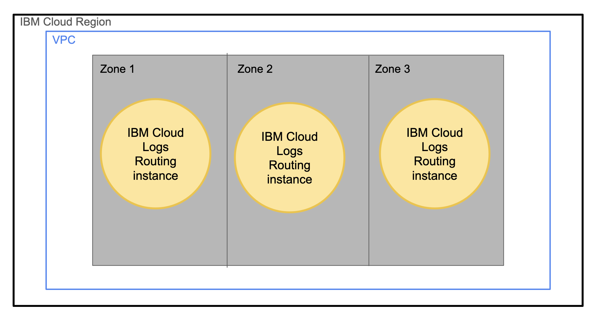

---

copyright:
  years:  2023, 2025
lastupdated: "2025-02-07"

keywords: HA for IBM Cloud Logs Routing, DR for IBM Cloud Logs Routing, IBM Cloud Logs Routing recovery time objective, IBM Cloud Logs Routing recovery point objective

subcollection: logs-router

---

{{site.data.keyword.attribute-definition-list}}

# Understanding high availability and disaster recovery for {{site.data.keyword.logs_routing_full_notm}}
{: #logs-router-ha-dr}

[High availability](#x2284708){: term} (HA) is the ability for a service to remain operational and accessible in the presence of unexpected failures. [Disaster recovery](#x2113280){: term} is the process of recovering the service instance to a working state.
{: shortdesc}

{{site.data.keyword.logs_routing_full_notm}} is a highly available, multi-tenant, regional service. You can find the available region and data center locations in the [Locations](/docs/logs-router?topic=logs-router-locations) documentation. As a regional service, {{site.data.keyword.logs_routing_full_notm}} fulfills the defined [Service Level Objectives (SLO)](/docs/resiliency?topic=resiliency-slo). The SLO is not a warranty and IBM will not issue credits for failure to meet an objective.

## High availability architecture
{: #ha-architecture}

An availability zone is a logically and physically isolated location within an {{site.data.keyword.cloud_notm}} region where your data is processed and hosted.
* An availability zone has independent power, cooling, and network infrastructures that are isolated from other zones to strengthen fault tolerance by avoiding single points of failure between zones.
* An availability zone offers high bandwidth and low inter-zone latency within a region.

A region (location) is a geographically and physically separate group of one or more availability zones with independent electrical and network infrastructures that are isolated from other regions.
* Regions are designed to remove shared single points of failure with other regions and low inter-zone latency within the region.
* Each region has 3 different data centers (DC) for redundancy.

### High availability features
{: #ha-features}

{{site.data.keyword.logs_routing_full_notm}} supports the following high availability features:

| Feature | Description |
| -------------- | -------------- |
| Multi-zone region deployment| {{site.data.keyword.logs_routing_full_notm}} is deployed  into multi-zone regions (MZRs) only, and within an MZR, the data plane cluster spans all three zones, ensuring that the loss of a zone does not impact service availability. |
| Liveness / readiness monitoring | All microservices are monitored via Kubernetes liveness and readiness probes. |
{: caption="HA features for {{site.data.keyword.logs_routing_full}}" caption-side="bottom"}

#### _Multi-zone region deployment_ for {{site.data.keyword.logs_routing_full_notm}}
{: #ha-feature-1}

{: caption="Diagram of high availability architecture for {{site.data.keyword.logs_routing_full_notm}}" caption-side="bottom"}

## Disaster recovery architecture
{: #disaster-recovery-intro}

The strategy for disaster recovery is to continuously maintain application data stored away from client data, so that the application can be restarted in an alternate region with the data that has been backed up. Recovery under these conditions expects user read / write activity to be restored within 8 hours of plan invocation without client intervention.

The new data is moved from one region to another region using cross-region {{site.data.keyword.cos_full_notm}} (COS) buckets along with continuous replication of data across sites.

### Disaster recovery features
{: #dr-features}

{{site.data.keyword.logs_routing_full_notm}} supports the following disaster recovery features:

| Feature | Description | Consideration |
| -------------- | -------------- | -------------- |
| Recovery center | Alternate site for storing and running the application, separate from the primary data center | No client action required. |
| Database backup | A backup of current service metadata is stored off site | Data is continuously streamed to the backup. Backup locations for each region [can be found here](/docs/cloud-databases?topic=cloud-databases-dashboard-backups&interface=ui#backup-locations) |
{: caption="DR features for {{site.data.keyword.logs_routing_full_notm}}" caption-side="bottom"}

### Planning for DR
{: #features-for-disaster-recovery}

The DR steps must be practiced regularly. As you build your plan, consider the following failure scenarios and resolutions.

Much of the preparation for disaster recovery for {{site.data.keyword.logs_routing_full_notm}} is included when properly onboarding to the service. Otherwise, you are responsible for monitoring for communications from the service as they come in, since further assistance may be needed when re-establishing normal operations, such as network connectivity for upstream data.

| Failure | Resolution | Consideration |
| -------------- | -------------- | ------| 
| Hardware failure (single point) | IBM provides a database that is resilient from single point of hardware failure within a zone - no configuration is required. | None needed. Covered by MZR deployment. |
| Zone failure | {{site.data.keyword.logs_routing_full_notm}} uses multi-zone region deployment that is resilient from a point of zone failure. No configuration required. | None needed. Covered by MZR deployment. |
| Data corruption | In case of data corruption, the database will be rolled back to the last stable state available in the backup site. Configuration required when onboarding. For more information, see [Your responsibilities for HA and DR](#feature-responsibilities). | None needed. Covered by service rollback plan. |
| Regional failure | When a regional failure occurs, a second site in an alternate region is maintained with synchronized data that will handle the workload. Configuration is required when onboarding. For more information, see [Your responsibilities for HA and DR](#feature-responsibilities). | Backup locations for each region [can be found here](/docs/cloud-databases?topic=cloud-databases-dashboard-backups&interface=ui#backup-locations) |
{: caption="DR scenarios for {{site.data.keyword.logs_routing_full_notm}}" caption-side="bottom"}

## Your responsibilities for HA and DR
{: #feature-responsibilities}

{{site.data.keyword.cloud_notm}} has [business continuity](#x3026801){: term} plans in place to provide for the recovery of services within hours if a disaster occurs. You are responsible for your data backup and associated recovery of your content once the data has been delivered to its defined target.

To establish cross-region high availability and protect your data from regional disaster, you must configure a cross-region {{site.data.keyword.logs_routing_full_notm}} target to send your data to, as {{site.data.keyword.logs_routing_full_notm}} tenants can only deliver logs to targets within its own region. [Learn more](/docs/logs-router?topic=logs-router-getting-started). 

When {{site.data.keyword.logs_routing_full_notm}} recovers in the region that is down, your configuration is restored.
{: important}

The following checklist associated with each feature can help you create and practice your plan.

- Subscribe to and follow platform notifications and announcements
   - Ensure preferences are set to receive emails about platform notifications.
   - Monitor the {{site.data.keyword.cloud_notm}} status page for general announcements.

For more information about your responsibilities when you are using {{site.data.keyword.logs_routing_full_notm}}, see [Shared responsibilities for {{site.data.keyword.logs_routing_full_notm}}](/docs/logs-router?topic=logs-router-shared-responsibilities).

## Recovery time objective (RTO) and recovery point objective (RPO)
{: #rto-rpo-features}

{{site.data.keyword.logs_routing_full_notm}} provides ways to protect your data and restore service functions. Business continuity plans are in place to achieve targeted [recovery point objective](#x3429911){: term} (RPO) and [recovery time objective](#x3167918){: term} (RTO) for the service. The following table outlines the targets for {{site.data.keyword.logs_routing_full_notm}}.

| Disaster recovery objective | Target Value   |
|---|---|
|  RPO |  Within 24 hours |
|  RTO |  Within 24 hours |
{: caption="RPO and RTO for {{site.data.keyword.logs_router_notm}}" caption-side="bottom"}

## Change management
{: #change-management}

Change management includes tasks such as upgrades, configuration changes, and deletion.

It is recommended that you grant users and processes the IAM roles and actions with the least privilege required for their work. See [Managing IAM access for IBM Cloud Logs Routing](https://cloud.ibm.com/docs/logs-router?topic=logs-router-iam).

Major, minor, and patch version updates for {{site.data.keyword.logs_routing_full_notm}} interfaces are handled by the  {{site.data.keyword.logs_routing_full_notm}} service team.

## How {{site.data.keyword.IBM}} helps ensure disaster recovery
{: #ibm-disaster-recovery}

{{site.data.keyword.logs_routing_full_notm}} is a highly available, regional, service.

A multizone region (MZR) consists of 3 or more availability zones that are independent from each other to ensure that that single failure events affect only a single zone.

By default, {{site.data.keyword.logs_routing_full_notm}} is deployed across 3 zones. Each zone is set up with `active/active/active`:
* Each zone is located in a different data center in the region.
* The data in each zone is automatically replicated to the other zones with low latency. You do not need to do anything to enable the replication.
* The service is designed to withstand a single zone failure with no interruption.
* If all the data centers in a location fail, {{site.data.keyword.logs_routing_full_notm}} becomes unavailable in that location.
* For more information about the regions where {{site.data.keyword.logs_routing_full_notm}} is available, see [Locations](/docs/logs-router?topic=logs-router-locations).

The MZR architecture offers automatic failover between zones within the region, and high availability for an {{site.data.keyword.logs_routing_full_notm}} deployment within a region.

The following table lists the high-availability (HA) status for the regions (locations) where the {{site.data.keyword.logs_routing_full_notm}} service is available:

| Geography             | Region                   | EU-Supported | HA Status |
|-----------------------|--------------------------|--------------|-----------|
| Asia Pacific  | Osaka (`jp-osa`) | NO | MZR       |
| Asia Pacific  | Sydney (`au-syd`) | NO | MZR       |
| Asia Pacific  | Tokyo (`jp-tok`) | NO | MZR       |
| Europe  | Frankfurt (`eu-de`) | YES | MZR       |
| Europe  | London (`eu-gb`) | NO | MZR       |
| Europe  | Madrid (`eu-es`) | YES | MZR       |
| North America  | Dallas (`us-south`) | N/A | MZR       |
| North America  | Toronto (`ca-tor`) | N/A | MZR       |
| North America  | Washington, D.C (`us-east`) | N/A | MZR       |
| South America  | Sao Paulo (`br-sao`) | N/A | MZR       |
{: caption="List of locations where the service is available" caption-side="top"}

Where
* A _geography_ is a geographic area or larger political body that contains one or more regions.
* A _region_ is a defined geographic territory.

    A region might be a specific postal code area, a town, a city, a state, a group of states, or even a group of countries.

    A region contains [multiple availability zones](https://www.ibm.com/cloud/data-centers/){: external} to meet local access, low latency, and security requirements for the region.

* `N/A` means feature that is not applicable to that geography.
* `MZR` means multi-zone region. [Learn more](/docs/overview?topic=overview-locations#table-mzr).

For more information about service availability within regions and data centers, see [Service and infrastructure availability by location](/docs/overview?topic=overview-services_region).

The data that is managed by {{site.data.keyword.logs_routing_full_notm}} in a region is kept in the data centers near that region.

{{site.data.keyword.logs_routing_full_notm}} data includes information about the targets where logging events are delivered for tenants that are onboarded to the region. A target is a resource where logging events are collected.

{{site.data.keyword.logs_routing_full_notm}} regularly backs up the data in each region:

- Regular backups are done daily and retained for 30 days.

- Continuous incremental backups are kept for the last 7 days.

{{site.data.keyword.logs_routing_full_notm}} data is replicated across multiple regions. Regular backups are stored across multiple regions and can be restored to other regions.

### How {{site.data.keyword.IBM_notm}} recovers from zone failures
{: #ibm-zone-failure}

In case of zone failure,  {{site.data.keyword.cloud_notm}} will resolve the zone outage. Since the data plane spans across all three zones in a region, there will be no impact to service availability, and the global load balancer will resume sending data to the restored zone. There will be no need for customer action at this time.

### How {{site.data.keyword.IBM_notm}} recovers from regional failures
{: #ibm-regional-failure}

If the regional state is corrupted, the service is restored to the state of the last internal backup, which is continuously streamed to an alternate data site in a cross-region  {{site.data.keyword.cos_full_notm}} bucket managed by the service. If backup data has been corrupted, there is a potential for 24-hour’s worth of data loss. These backups are not available for customer-managed disaster recovery.

If {{site.data.keyword.IBM_notm}} can’t restore the service instance, the customer must take steps to restore access to {{site.data.keyword.logs_routing_full_notm}} as described in [Your responsibilities for HA and DR](#feature-responsibilities).

## How {{site.data.keyword.IBM_notm}} maintains services
{: #ibm-service-maintenance}

All upgrades follow the {{site.data.keyword.IBM_notm}} service best practices and have a recovery plan and rollback process in-place. Regular upgrades for new features and maintenance occur as part of normal operations. Such maintenance can occasionally cause short interruption intervals that are handled by [client availability retry logic](/docs/resiliency?topic=resiliency-high-availability-design#client-retry-logic-for-ha). Changes are rolled out sequentially, region by region and zone by zone within a region. Updates are backed out at the first sign of a defect.

Complex changes are enabled and disabled with feature flags to control exposure.

Changes that impact customer workloads are detailed in notifications. For more information, see [monitoring notifications and status](/docs/account?topic=account-viewing-cloud-status) for planned maintenance, announcements, and release notes that impact this service.
